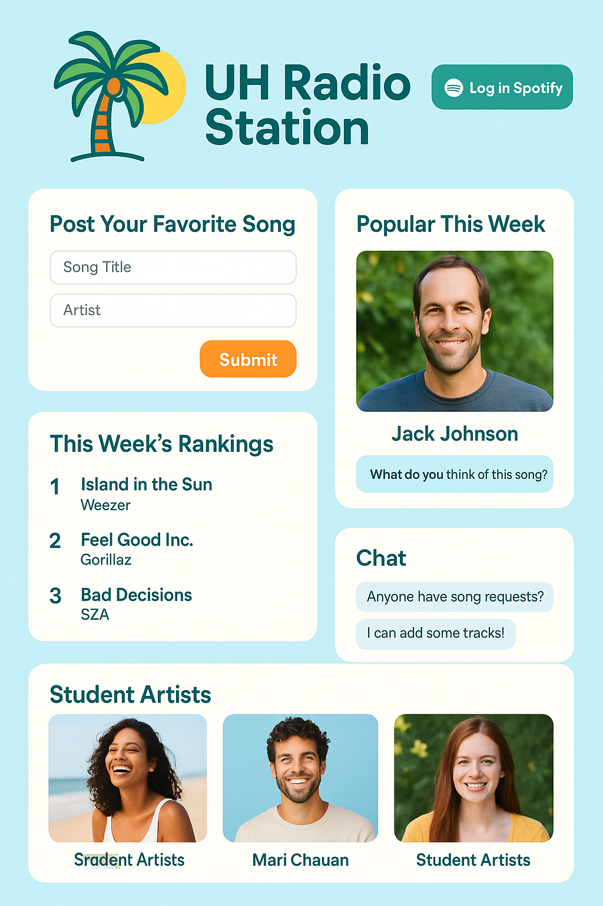

# 🎧 UH Campus Radio Station

Welcome to the **UH Radio Station Project** — a student-run music-sharing platform across all UH campuses.

## 📌 Project Overview

This project aims to create a website where UH students can:

- Post their favorite songs (via Spotify login)
- View weekly/monthly song rankings by **major, year, or campus**
- Highlight each campus's unique **musical vibe**
- Showcase original music by **student artists**
- Stream curated music during **campus events or lunchtime**

## 🛠️ Technologies Used

- **Frontend**: HTML, CSS, JavaScript
- **Backend**: Node.js, Express
- **Authentication/API**: Spotify OAuth
- **Hosting**: GitHub Pages
- (Optional): Firebase or MongoDB for data storage

## 📈 Future Goals

- Enable real-time music submission and voting
- Display interactive charts
- Build a dashboard for student artists
- Stream music like a **real-time radio station**

## 🧪 Mockup Pages
- I asked chatgpt to generate the mockup images of this website with below function.
- he generated this image.

- A bright, island-inspired theme with a tropical vibe
- A header that displays "UH Radio Station" prominently
- A Spotify login button for students to easily connect
- A simple song submission form where students can post their favorite tracks
- A "This Week's Rankings" section showing the top trending songs
- Featured cards introducing student artists with profile images and links
- Mobile-friendly design that works well on phones and tablets
- A section for weekly featured artists, including links to their songs and a place to comment, like a radio station discussion area
- An integrated chat area similar to Discord, where students can talk about music, request songs, or connect with others
- Overall layout is clean, simple, and visually appealing, with a fun and welcoming tone

source 'https://rubygems.org'
gem 'jekyll', '~> 4.3.2'

